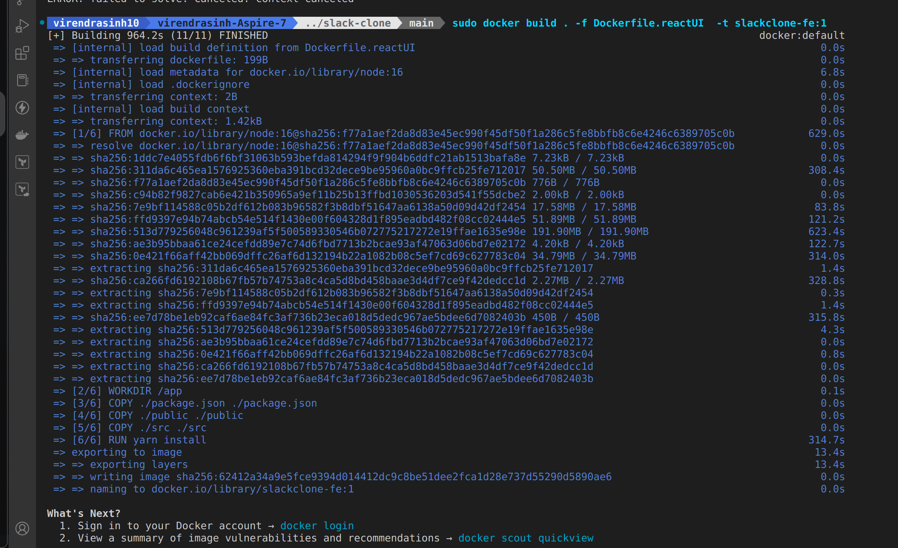
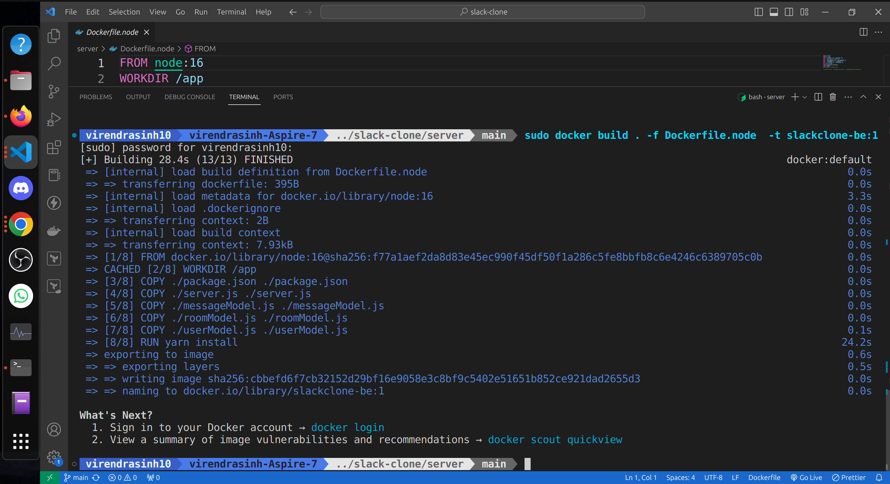
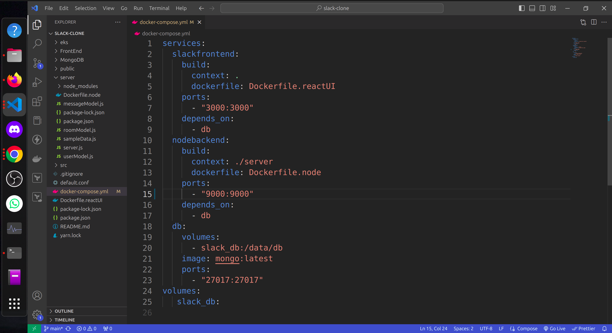

# Dockerizing a MERN Stack Slack Clone Application

Docker helps you containerize your MERN Stack — letting you bundle together your complete Slack clone application, runtime, configuration, and OS-level dependencies. This includes everything needed to ship a cross-platform, multi-architecture web application.

## Running the Application with Docker
-**Images:** Immutable templates containing application code, dependencies, and settings.

-**Containers:** Runnable instances of Docker images, isolated from one another.

-**Dockerfile:** Text file specifying instructions for building Docker images.

-**Docker Engine:** Core component managing Docker containers and images.

### Step 1: Install Docker Desktop

First, we’ll need to download Docker Desktop and complete the installation process. This includes the Docker CLI, Docker Compose, and a user-friendly management UI. These components will each be useful later on.

Also our slack clone has a react front end and node backend and has MongoDB as our data base. So first lets start with the frontend.


### Step 2: Containerizing Your React Frontend

We’ll build a Dockerfile to containerize our React.js frontend and Node.js backend.

#### Dockerfile.reactUI

```Dockerfile
FROM node:16
WORKDIR /app
COPY ./package.json ./package.json
COPY ./public ./public
COPY ./src ./src
RUN yarn install
EXPOSE 3000
CMD ["yarn","start"]```


Next, let’s build our image:

```docker build . -f Dockerfile.reactUI -t slackclone-fe:1
```




### Step 3: Containerizing Our Node.js Backend

#### Dockerfile.node

```FROM node:16
WORKDIR /app
COPY ./package.json ./package.json
COPY ./server.js ./server.js
COPY ./messageModel.js ./messageModel.js 
COPY ./roomModel.js ./roomModel.js
COPY ./userModel.js ./userModel.js
RUN yarn install 
EXPOSE 9000
CMD ["node", "server.js"]```


Now, let’s build our image:
```docker build . -f Dockerfile.node -t slackclone-be:1
```



### Step 4: Defining Services using a Compose file

Here’s how our services appear within a Docker Compose file:


```
services:
  slackfrontend:
    build:
      context: .
      dockefile: Dockerfile.reactUI
    ports:
      - "3000:3000"   
    depends_on:
      - db
  nodebackend:
    build:
      context: ./server
      dockerfile: Dockerfile.node
    ports:
      - "9000:9000"   
    depends_on:
      - db
  db:
    volumes:
      - slack_db:/data/db
    image: mongo:latest
    ports:
      - "27017:27017" 
volumes:
   slack_db:
```



React Frontend, Node Backend, Mongo Up and Running, 

On visiting Port 3000 we can see: 


### Conclusion
With a single YAML file, we’ve demonstrated how Docker Compose helps you easily build and deploy your MERN stack in seconds. With just a few extra steps, you can apply this tutorial while building applications with even greater complexity. Happy developing.


